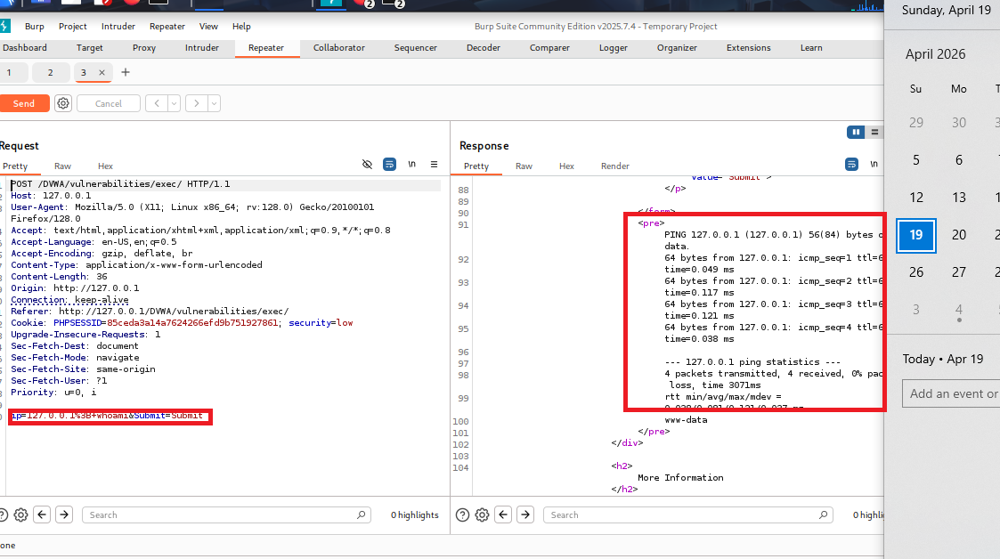
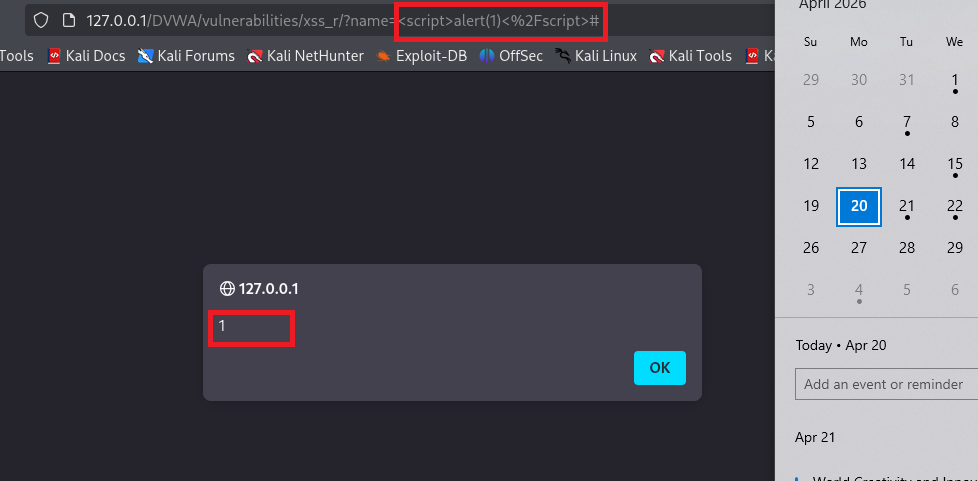
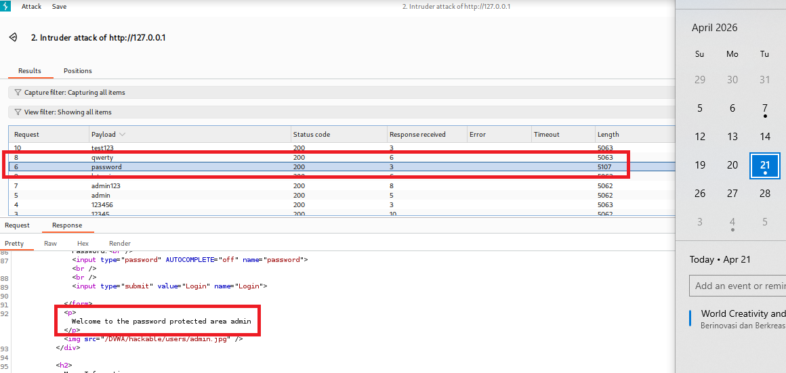

# 🔐 DVWA Vulnerability Assessment & Penetration Testing (VAPT)

## 📌 Project Overview
This repository contains a Vulnerability Assessment and Penetration Testing (VAPT) report conducted on DVWA (Damn Vulnerable Web Application) in a controlled lab environment.

The objective of this project is to identify, analyze, and document security vulnerabilities in a web application using manual and semi-automated testing techniques.

---

## 🎯 Target System
- Application: Damn Vulnerable Web Application (DVWA)
- Environment: Local Lab (Kali Linux)
- Date: April 2026

---

## 🧪 Methodology
- Information Gathering
- Vulnerability Scanning
- Manual Exploitation
- Proof of Concept (PoC)
- Reporting & Analysis

---

## 🛠 Tools Used
- Burp Suite
- Kali Linux
- SQLMap
- Nmap
- Metasploit Framework

---

## ⚠️ Key Findings

### 1. SQL Injection (Critical)
- Unauthorized database access
- Data extraction via payload manipulation

### 2. Command Injection (Critical)
- Remote command execution on server

### 3. Cross-Site Scripting (XSS) (High)
- Client-side script execution

### 4. Brute Force Attack (High)
- Weak authentication mechanism

---

## 📊 Impact
These vulnerabilities may lead to:
- Data leakage
- System compromise
- Unauthorized access
- Remote command execution

---

## 🔐 Recommendations
- Input validation & sanitization
- Use prepared statements
- Implement rate limiting & account lockout
- Enable security headers (CSP, HttpOnly cookies)
- Continuous security testing

---

## 📁 Evidence

### SQL Injection

### Command Injection

### XSS

### Brute Force

---

## 👨‍💻 Author
Hariansah  
SOC Analyst L1 | Junior Penetration Tester (CEH)
